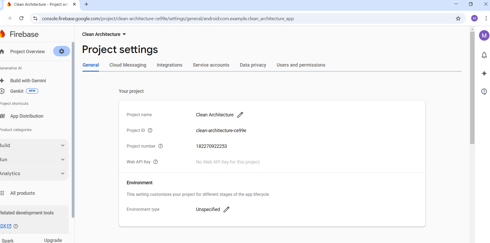
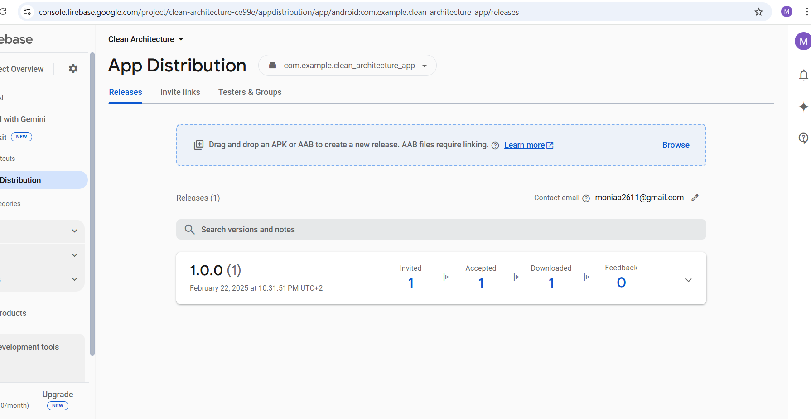

# ✅ Flutter To-Do List App - Clean Architecture

## 📌 Overview

This document outlines the testing and distribution process for the Flutter To-Do List App using
Firebase and App Distribution.

---

## 🔍 Testing Strategy

### 1️⃣ Setup Firebase in Flutter
- 
- Used **Firebase CLI** for deployment.

```bash
firebase login
firebase init
```

### 2️⃣ App Distribution with Firebase

- **App Distribution** forUploaded APK/AAB for testers.
- Provided real-time crash reports via Crashlytics.

```bash
firebase appdistribution:distribute build/app-release.apk \
--app <YOUR_FIREBASE_APP_ID> \
--groups testers \
--release-notes "Bug fixes & performance improvements"
```

### 3️⃣ Testers Access

- Invited testers via Firebase Console.
- Sent email notifications for new releases.

### 🚀 Features

- ✅ Fetch To-Do List from a remote API.

- 🛠 Clean Architecture with well-structured layers.

- 🎯 Dependency Injection using GetIt.

- 🔄 State Management with Provider.

- 📝 Well-structured and modular code.

### Screenshots




